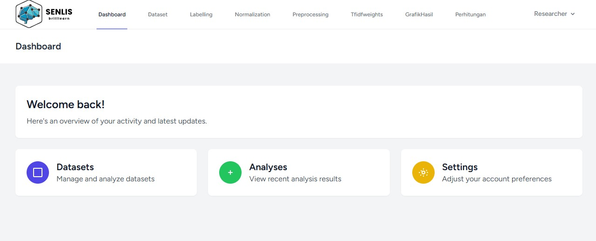
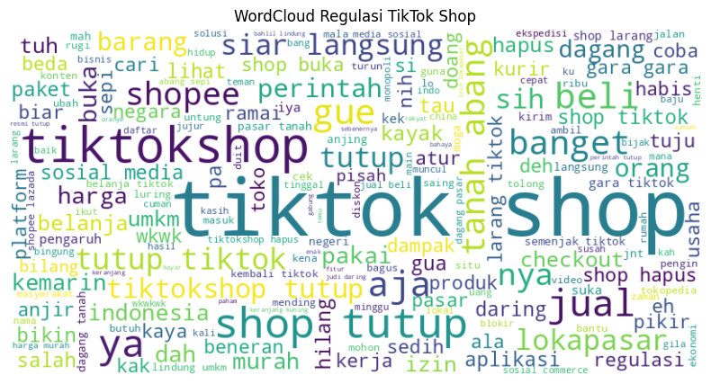
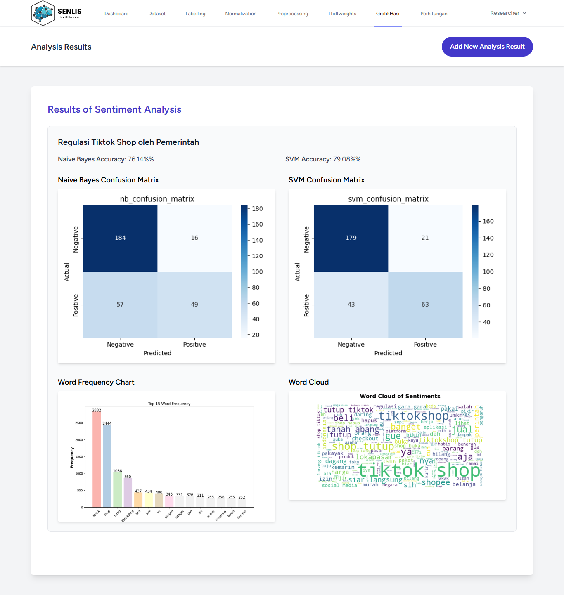

# Sentiment Analysis System — TikTok Shop Regulation  

  

[](LICENSE)       

Sistem analisis sentimen untuk mengevaluasi opini publik terkait regulasi **TikTok Shop oleh pemerintah Indonesia**, menggunakan data dari Twitter.  
Dikembangkan dengan **Laravel + Python (scikit-learn)**, mendukung preprocessing otomatis, pembobotan TF-IDF, dan klasifikasi dengan **Naïve Bayes & SVM**.  

---

## ✨ Key Features  
- [ ] Crawling data dari Twitter API *(coming soon)*  
- [x] Preprocessing teks (cleansing, tokenizing, stemming)  
- [x] TF-IDF word weighting  
- [x] __*(underconstruction)__ Sentiment classification (positive/negative)  
- [x] Evaluasi model (accuracy, precision, recall, F1-score)  
- [x] __*(underconstruction)__ Dashboard interaktif  

  

---

## 📊 Results  
- **Naïve Bayes accuracy**: 76.14%  
- **SVM accuracy**: 79.08%  

  

---

## 🛠️ Tech Stack  
Laravel, PHP, Python (scikit-learn, pandas), MySQL, Bootstrap, Git  

---

## 🚀 Quick Start
1. Clone repository
    ```bash
    git clone https://github.com/DidinOS9/senlis_system.git
    cd senlis_system
    ```
2. Install dependencies

    ```bash
    composer install
    npm install
    pip install -r requirements.txt
    ```
4. Konfigurasi file .env
5. Migrasi database dan jalankan seeder
   
    ```bash
    php artisan migrate --seed
    ```
    Setelah seeder dijalankan, tersedia akun default untuk login:
    - Email: researcher@mail
    - Password: 123123123

5. Jalankan aplikasi
   - Laravel Backend
    ```bash
    php artisan serve
    ```
    - Laravel Frontend (Vite)
      
    ```bash
    npm run dev                    # Laravel Frontend (Vite)
    ```
    - Python Sentiment Analysis
   
    ```bash
    python storage/app/preprocessing/app.py 
    ```
6. Akses sistem di http://localhost:8000
   Login menggunakan akun seeder di atas.

## 📌 Rencana Fitur Selanjutnya
 - [ ] Integrasi crawling data Twitter API
 - [ ] Multi-class sentiment (positif, netral, negatif)
 - [ ] Penerapan deep learning (LSTM, BERT)
 - [ ] Export hasil analisis ke Excel/PDF
 - [ ] Manajemen user dengan role berbeda (admin, researcher, viewer)

## 📄 Lisensi
 Proyek ini dilisensikan di bawah MIT License.
